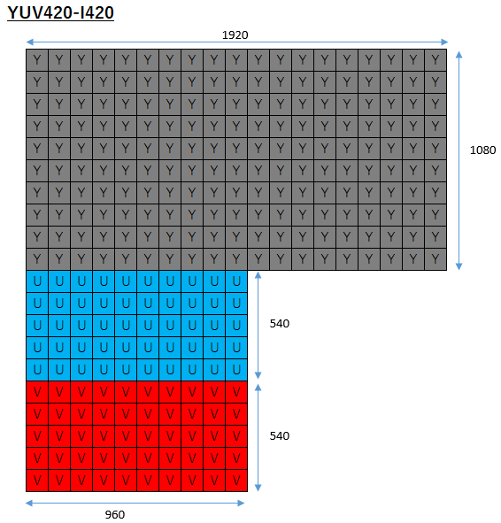
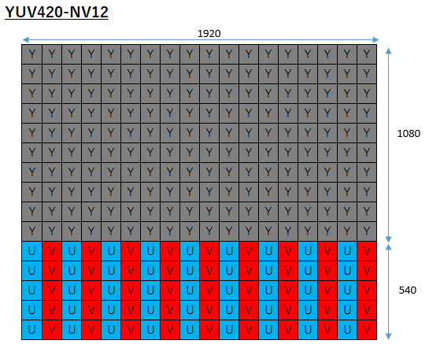

`YUY2` `I420` といった単語をよく目にするけど、こいつらって結局どう違うんじゃい！  
というのを完全に理解できるようにまとめた  

## そもそも、YUVとは

RGBで1pixelを表すと、R, G, B で8bitずつ、計24bit必要だが、  
YUVでは `輝度信号(白黒)` と `色差信号` に分割し、`色差信号` の情報量を減らす(ダウンサンプリングする)ことで伝送効率等を良くする。  
人間の目は輝度の変化には敏感な一方で、色の変化には鈍感なため、多少間引いても分からないらしい。  

| サンプル比 | Y    | U    | V    | bpp   | ダウンサンプリングの方式                         |
| ---------- | ---- | ---- | ---- | ----- | ------------------------------------------------ |
| YUV444     | 8bit | 8bit | 8bit | 24bit | ダウンサンプリング無し                           |
| YUV422     | 8bit | 4bit | 4bit | 16bit | 水平ダウンサンプリング                           |
| YUV411     | 8bit | 2bit | 2bit | 12bit | 水平ダウンサンプリング                           |
| YUV420     | 8bit | 2bit | 2bit | 12bit | 水平ダウンサンプリング<br>垂直ダウンサンプリング |

※bpp(bits per pixel)

例えば `YUV422` だと、`U` と `V` をそれぞれ半分に間引き(水平ダウンサンプリング)して、 8 + 4 + 4 で16bppとなる。  
しかし `YUV420` では0といってもVが0になるわけではなく、水平ダウンサンプリングと垂直ダウンサンプリングを併用して 8 + 2 + 2 で12bppとなる。  

ダウンサンプリングについてはこちらの図が分かりやすいため引用

<https://learn.microsoft.com/ja-jp/windows/win32/medfound/recommended-8-bit-yuv-formats-for-video-rendering#yuv-sampling>  


## 代表的なYUVフォーマット

| サンプル比 | format      | FOURCC コード | 並び順 | bpp   |
| ---------- | ----------- | ------------- | ------ | ----- |
| YUV422     | Packed      | YUY2          | YUV    | 16bit |
| YUV420     | Planar      | I420          | YUV    | 12bit |
| YUV420     | Semi-planar | NV12          | YUV    | 12bit |

メモリ上への配置の仕方の違い(`Packed format`, `Planar format`, `Semi-planar format`)によって名前が変わったりする  
ここからはちょっとややこしくなる  

以下、1920x1080の画像がメモリ上にどう並ぶのかの例

## YUV422, Packed format, YUY2

YUYVのパックが順に並ぶ

| -           | stride | height |
| ----------- | ------ | ------ |
| YUVのパック | 3840   | 1080   |


## YUV420, Planar format, I420

Y, U, V のPlanar(平面)が順に並ぶ

| -   | stride | height |
| --- | ------ | ------ |
| Y   | 1920   | 1080   |
| U   | 960    | 540    |
| V   | 960    | 540    |



ほとんどのビデオデコーダは生の画像をI420形式で出力するため、目にする機会も多い。  
自分はこれをそのまま取り扱おうとしてパディングの問題でハマったことがある。  
パディングについては後述する

## YUV420, Semi-planar format, NV12

YのPlanar(平面)が並んだ後、  
UとVが交互に配置されたPlanar(平面)が並ぶ  

| -    | stride | height |
| ---- | ------ | ------ |
| Y    | 1920   | 1080   |
| U, V | 1920   | 540    |



## 【おまけ】OpenCVで読み込む

ビデオデコーダから渡されたデータをOpenCVで読み込むこともできる  
以下はNV12のデータを読み込んでRGBに変換する例  

```cpp
cv::Mat process(void *a_frame)
{
    cv::Mat src(m_height * 1.5, m_width, CV_8UC1, a_frame);
    cv::Mat rgb;
    cv::cvtColor(src, rgb, cv::COLOR_YUV2RGB_NV12);
    return rgb;
}
```

## 【おまけ】パディングでおかしくなる

ビデオデコーダから生で出力されたI420形式のデータにはパディングが含まれている場合がある。  
これをそのままOpenCV等で扱おうとすると、色合いが狂う  


例えばGStreamerであれば、offsetという変数を見ることでpaddingがあるかどうかを判断できる  

## 参考サイト

- <https://learn.microsoft.com/ja-jp/windows/win32/medfound/recommended-8-bit-yuv-formats-for-video-rendering>
- <https://learn.microsoft.com/ja-jp/windows/win32/medfound/about-yuv-video?source=recommendations#benefits-of-yuv>
- <https://learn.microsoft.com/ja-jp/windows/win32/medfound/video-fourccs>
- <https://learn.microsoft.com/ja-jp/windows-hardware/drivers/display/4-2-0-video-pixel-formats>
- <https://wiki.videolan.org/YUV>
- [YUVフォーマット及び YUV<->RGB変換](https://hk.interaction-lab.org/firewire/yuv.html)

## おわりに

間違ってる箇所があったらコメントください
